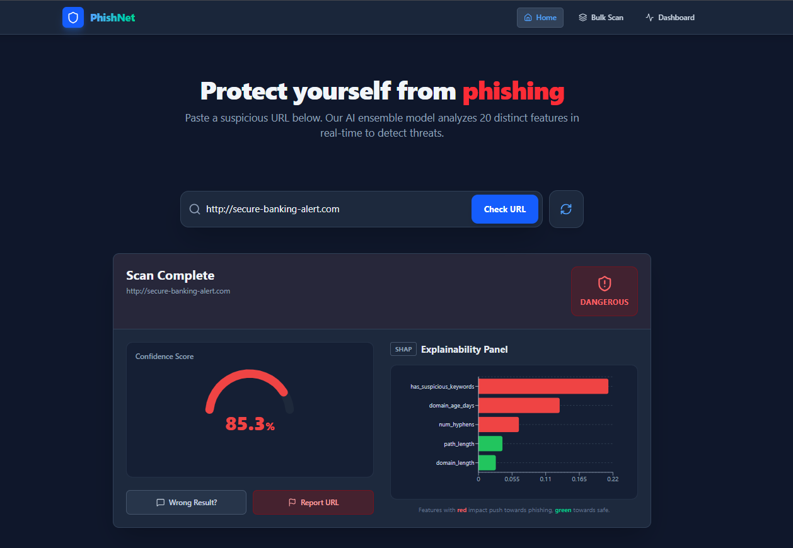
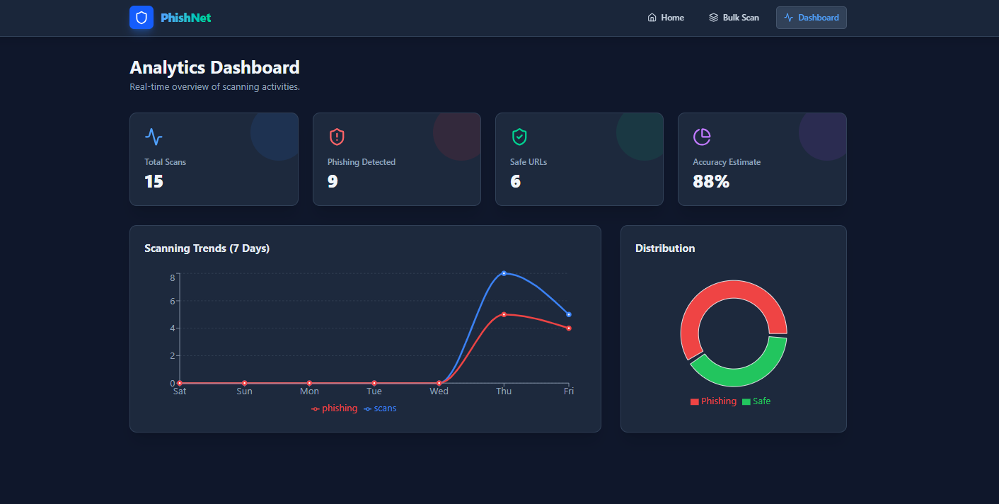
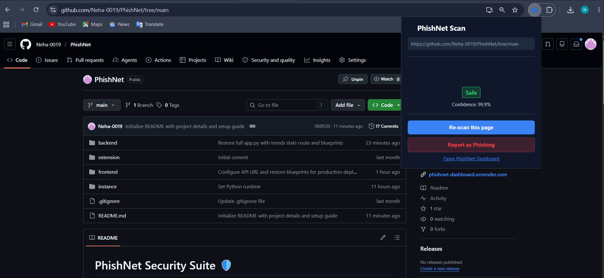

# PhishNet Security Suite 🛡️

PhishNet is an end-to-end, AI-powered cybersecurity suite designed to detect phishing URLs in real-time. By utilizing an ensemble machine learning classifier (Random Forest, XGBoost, and Support Vector Machine) combined with Explainable AI (SHAP), PhishNet categorizes URL threats and explains exactly why a site was classified as safe, suspicious, or dangerous.

**🔗 Live Demo:** [https://phishnet-dashboard.onrender.com](https://phishnet-dashboard.onrender.com)

---

## 📸 Screenshots

### 1. Phishing Scan Results & Explainability Panel

### 2. Live Analytics Dashboard

### 3. Chrome Extension Popup

---

## 🚀 Key Features

* **Real-time Chrome Extension:** Actively monitors pages as you browse, shows visual badges (✓ or ⚠) on threat status, and alerts users via desktop notifications.
* **Interactive React Dashboard:** An elegant dark-themed analytics interface displaying scanning metrics, historical logs, and threat classifications.
* **SHAP Explainability Panel:** Uses Game Theory (SHAPley Additive exPlanations) to display custom bar charts showing which features (e.g., domain age, dots, keywords) influenced the model's decision.
* **CSV Bulk Scanner:** Allows users to upload lists of domains to evaluate them in batch.
* **Trusted Allowlist:** A built-in bypass mechanism to prevent major sites (like Google, Amazon, and GitHub) from generating false positives.

---

## 🛠️ Tech Stack

### Frontend (React Dashboard)
* **Framework:** React 19 + Vite 8
* **Styling:** Tailwind CSS v4
* **Charts:** Recharts v3
* **Icons:** Lucide React

### Backend (AI API)
* **Framework:** Flask 3.0 (Python)
* **ORM:** Flask-SQLAlchemy (relational database adapter)
* **Database:** SQLite (dev) / PostgreSQL (production compatible)

### Machine Learning & XAI
* **Classifier:** Soft Voting Ensemble (Random Forest + XGBoost + SVC)
* **Explainability:** SHAP 0.45.0 (TreeExplainer)
* **Libraries:** Scikit-Learn 1.4.2, XGBoost 2.0.3, Pandas, Numpy

---

## 📦 Project Structure

* **`backend/`** - Python Flask API & Machine Learning models
  * `database/` - SQLAlchemy database models and schema
  * `features/` - Custom URL feature extraction scripts
  * `model/` - Trained `.pkl` model pipelines and training scripts
  * `routes/` - API endpoints (predict, stats, feedback, bulk)
* **`frontend/`** - React SPA (Vite + Tailwind CSS v4)
* **`extension/`** - Chrome Extension (Manifest V3 client agent)
* **`screenshots/`** - Folder containing project demonstration images

---

## 💻 Running the Project Locally

### 1. Run the Flask Backend
Navigate to the `backend` folder, set up your Python environment, and run the server:
1. `cd backend`
2. `python -m venv venv`
3. `.\venv\Scripts\Activate` *(On Windows)* or `source venv/bin/activate` *(On macOS/Linux)*
4. `pip install -r requirements.txt`
5. `python app.py`

*The API will start running on `http://127.0.0.1:5000`.*

### 2. Run the React Dashboard
Navigate to the `frontend` folder, install npm packages, and run the Vite server:
1. `cd ../frontend`
2. `npm install`
3. `npm run dev`

*The dashboard will be available at `http://localhost:5173`.*

### 3. Load the Chrome Extension
1. Open Google Chrome and go to `chrome://extensions/`.
2. Enable **Developer Mode** (top-right corner).
3. Click **Load unpacked** (top-left corner).
4. Select the `extension` folder inside this project directory.

---

## 🌐 Deployment Details

This project is configured to deploy directly to **Render**:
* **Backend:** Hosted as a Python Web Service linked to the `/backend` subfolder.
* **Frontend:** Hosted as a Static Site linked to the `/frontend` subfolder with build output target `dist`.
